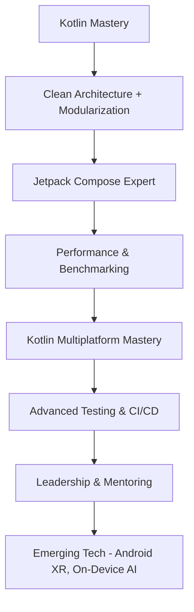

# 📍 Android Senior Roadmap 2025


**Moe Kyaw Aung (@Moekyawaung-coder)**  
Transforming into a Senior Android Engineer with full public transparency.

**Overall Progress:** 

## 🎯 8-Phase Senior Roadmap (2025–2026)

```mermaid
graph TD
    A[Phase 0: Kotlin & Coroutines Mastery] --> B[Phase 1: Clean Architecture & Modularization]
    B --> C[Phase 2: Jetpack Compose Expert + Design Systems]
    C --> D[Phase 3: Performance Engineering & Benchmarking]
    D --> E[Phase 4: Kotlin Multiplatform (KMP)]
    E --> F[Phase 5: Advanced Testing & Quality Assurance]
    F --> G[Phase 6: CI/CD, Release Engineering & DevOps]
    G --> H[Phase 7: Leadership, Mentoring & System Design]
    H --> I[Phase 8: Emerging Technologies (Android XR, On-Device AI, Wear OS 5)]
```

### Current Status (Updated 2025)
- Phase 0 & 1: ✅ 100% Completed
- Phase 2: 🔄 55% (Building reusable Compose Design System)
- Phase 3–8: ⏳ Planned

### How This Repository Connects
- Portfolio → [Repository 2](https://github.com/Moekyawaung-coder/moekyawaung-dev)
- Live Dashboard → [Repository 3](https://github.com/Moekyawaung-coder/senior-dev-dashboard)
- Real Projects → [Repository 4](https://github.com/Moekyawaung-coder/senior-android-capstone-projects)

**Star this repo** ⭐ if you are also on the senior Android journey!

**LinkedIn:** https://www.linkedin.com/in/moe-kyaw-aung-2653093a1
```

# 📍 Android Senior Roadmap 2025


**Moe Kyaw Aung (Moekyawaung)** — My transparent journey to Senior Android Engineer.

**Current Progress:** 

## 🎯 8-Phase Senior Roadmap



### Phase Status
- Phase 0 & 1: ✅ Completed
- Phase 2: 🔄 In Progress (Compose Design System)
- Phase 3-7: ⏳ Planned

**Live Projects:** See Repository 4 (Senior Capstone Projects)

⭐ Star this repo if you are also leveling up to Senior Android Engineer!
```
